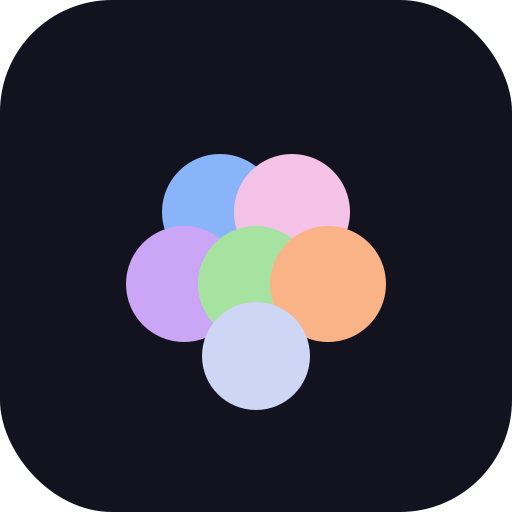
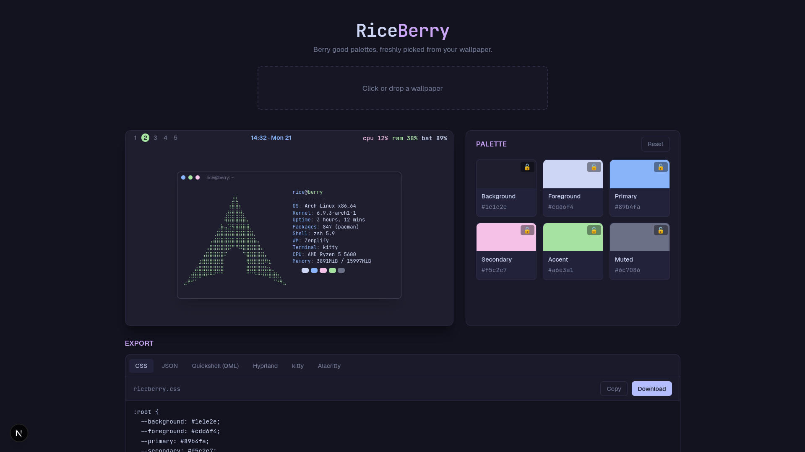
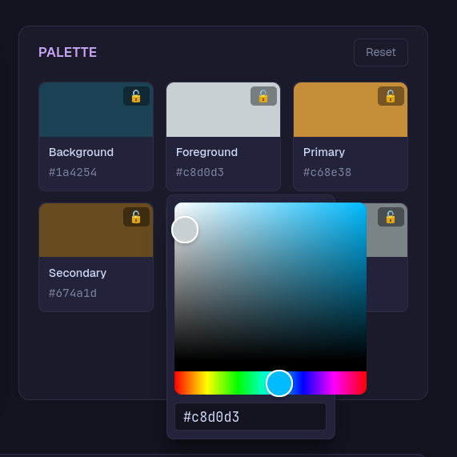
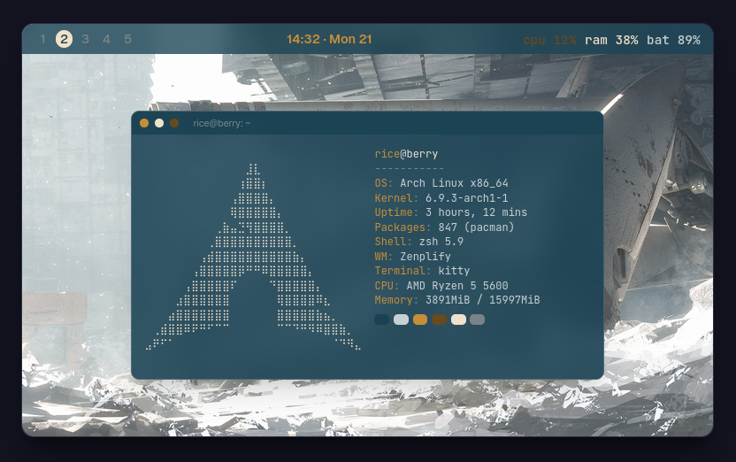
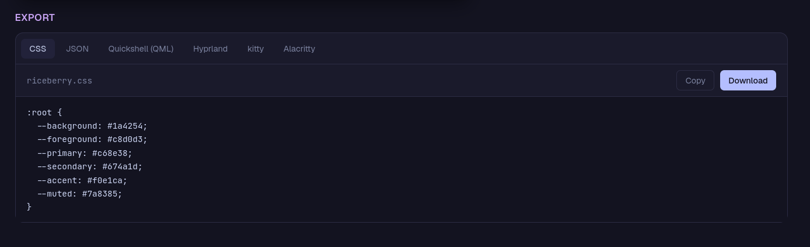

<div align="center">

<!-- SCREENSHOT SLOT · LOGO
     Drop your favicon/logo here. Commit it to docs/ and update the path,
     or drag an image into this line in GitHub's editor. Recommended ~120px. -->


# Rice<span>Berry</span>

**Berry good palettes, freshly picked from your wallpaper.**

Upload a wallpaper → extract & tweak a color palette → preview it live on a ricing-style desktop → export ready-to-paste theme configs.

[](https://nextjs.org/)
[](https://react.dev/)
[](https://www.typescriptlang.org/)
[](https://tailwindcss.com/)

<!-- Add your deployment link when it's live -->
**[Live Demo](#)** · **[Report an issue](https://github.com/cookeroni/riceberry/issues)**

</div>

---

<!-- SCREENSHOT SLOT · HERO
     A wide shot of the whole app with a wallpaper loaded looks best here. -->


---

## Contents

- [Inspiration](#inspiration)
- [Features](#features)
- [How it works](#how-it-works)
- [Screenshots](#screenshots)
- [Export formats](#export-formats)
- [Tech stack](#tech-stack)
- [Getting started](#getting-started)
- [Project structure](#project-structure)
- [Limitations](#limitations)
- [Roadmap](#roadmap)
- [Credits](#credits)
- [License](#license)

---

## Inspiration

RiceBerry is inspired by [wallrice.xyz](https://www.wallrice.xyz), but goes in a much simpler and more practical built for everyday use.

WallRice recolors a *wallpaper* to match a palette and stops there. RiceBerry does the reverse: it generates a palette **from** your wallpaper and then helps you actually **use** that palette everywhere — the real ["ricing" workflow](https://www.reddit.com/r/unixporn/) that tools like [pywal](https://github.com/dylanaraps/pywal) and [matugen](https://github.com/InioX/matugen) automate.

It was also built as a companion to **Zenplify**, a [Quickshell](https://quickshell.org/) desktop shell — RiceBerry exports a `Theme.qml` block that drops straight into it. So the loop is: *find a wallpaper you love → RiceBerry → paste the config → your whole desktop matches.*

---

## Features

- **Drag-or-click upload** with instant image preview and validation (JPEG / PNG / WebP, up to 15 MB).
- **Automatic palette extraction** into six semantic roles — `background`, `foreground`, `primary`, `secondary`, `accent`, `muted`.
- **Per-swatch editing** — click any swatch to open a color picker, or click its hex to copy.
- **Lock swatches** so a re-extract or reset never overwrites a color you've dialed in.
- **Reset** — re-extract from the current image, or restore the default palette when none is loaded (locks respected either way).
- **Live desktop preview** — a fake ricing desktop (bar + neofetch terminal) that re-themes **as you edit**, powered entirely by CSS variables.
- **Six export formats**, each with copy-to-clipboard and download-as-file.
- **Runs entirely in your browser** — no upload leaves your machine, no account, no backend.

---

## How it works

The whole app is built around **one central palette object**. Everything else — the preview, every export — is just a different *view* of that single piece of state, so edits propagate everywhere automatically.

```
Upload wallpaper  →  Extract & tweak palette  →  Live preview  →  Export configs
```

1. **Extraction.** [`node-vibrant`](https://github.com/Vibrant-Colors/node-vibrant) samples the image's pixels and returns named swatches (Vibrant, Muted, DarkVibrant, …). RiceBerry maps those onto its six roles, with a safe fallback to a default color for any swatch an image doesn't yield — so extraction always returns a complete palette and never breaks downstream code.

2. **Editing.** The palette is the single source of truth. Swatch edits, locks, and resets are pure state updates; the `locked` flag lives inside the model, so "don't overwrite this on re-extract" is trivial to honor.

3. **Live preview.** The current palette is written out as CSS custom properties on the preview container; every element inside paints with `var(--…)`. Change a swatch → state updates → the variables change → the mock desktop repaints instantly.

4. **Export.** Each format is a pure `(palette) => string` function registered in one array. Adding a new format is a single entry — no plumbing.

---

## Screenshots

<!-- Fill these in as you go. To add an image on GitHub you can either:
     1) commit files under docs/screenshots/ and keep the relative paths below, or
     2) drag an image straight into this file in GitHub's web editor,
        which uploads it and inserts a user-content URL for you. -->

### Extract & tweak

<!-- SCREENSHOT SLOT · palette editing (picker open, a locked swatch) -->


### Live desktop preview

<!-- SCREENSHOT SLOT · the themed preview (bar + terminal) over a wallpaper -->


### Export configs

<!-- SCREENSHOT SLOT · the export panel with the QML tab selected -->


---

## Export formats

| Format | Output file | Best for |
| --- | --- | --- |
| CSS variables | `riceberry.css` | Web projects, any `:root` theming |
| JSON | `riceberry.json` | Scripts, other tools, programmatic use |
| Quickshell (QML) | `Theme.qml` | Zenplify / Quickshell shells |
| Hyprland | `riceberry.conf` | Hyprland color variables |
| kitty | `riceberry-kitty.conf` | kitty terminal |
| Alacritty | `riceberry-alacritty.toml` | Alacritty terminal |

> The QML export themes Zenplify's surface and text colors (`pillBg`, `textPrimary`, `textMuted`, `textSecondary`, `textAccent`) from the palette. Zenplify's semantic status colors (success / warning / danger, etc.) are intentionally left to your own config so state indicators stay meaningful.

---

## Tech stack

- **[Next.js](https://nextjs.org/) 16** (App Router)
- **[React](https://react.dev/) 19**
- **[TypeScript](https://www.typescriptlang.org/)** — a typed palette model and component props
- **[Tailwind CSS](https://tailwindcss.com/) v4** — styling and theming via CSS variables
- **[node-vibrant](https://github.com/Vibrant-Colors/node-vibrant) v4** — palette extraction
- **[react-colorful](https://github.com/omgovich/react-colorful)** — the per-swatch color picker

No backend, no database — everything runs client-side, which keeps deployment trivial (e.g. [Vercel](https://vercel.com/)).

---

## Getting started

**Prerequisites:** [Node.js](https://nodejs.org/) 20 or newer.

```bash
# clone
git clone https://github.com/cookeroni/riceberry.git
cd riceberry

# install
npm install

# run the dev server
npm run dev
```

Open **http://localhost:3000** in your browser.

To build and run a production version:

```bash
npm run build
npm start
```

---

## Project structure

```
src/
├─ app/
│  ├─ layout.tsx        # root layout, fonts, metadata
│  ├─ page.tsx          # the single page: holds the palette state
│  ├─ globals.css       # Tailwind + app theme tokens
│  └─ icon / favicon    # tab icon
├─ components/
│  ├─ Uploader.tsx      # drag/click upload + validation
│  ├─ PaletteEditor.tsx # the swatch grid + reset
│  ├─ SwatchCard.tsx    # one swatch: picker, lock, copy
│  ├─ PreviewDesktop.tsx# the fake desktop (owns the CSS vars)
│  ├─ PreviewBar.tsx    # Zenplify-style top bar
│  ├─ PreviewTerminal.tsx # neofetch-style window
│  └─ ExportPanel.tsx   # format tabs + copy/download
├─ lib/
│  ├─ extract.ts        # image → Palette (with lock-aware merge)
│  └─ exporters.ts      # Palette → config strings (one per format)
└─ types/
   └─ palette.ts        # the Palette type — the single source of truth
```

---

## Limitations

- **Palettes reflect the image.** A near-monochrome wallpaper produces a near-monochrome palette — that's the extractor working correctly, not a bug. Low-variety images are where manual tweaking earns its keep.
- **The role mapping is a heuristic** tuned for dark themes (dark base, light text). It's a strong starting point, not a guarantee for every image.
- **The QML export is Zenplify-shaped.** The `primary` role has no natural slot in Zenplify's theme and isn't written to `Theme.qml` (it's still present in the CSS and JSON exports). Other shells expecting a different structure will need their own exporter.
- **No persistence yet.** Palettes aren't saved between sessions.
- **No built-in sample wallpapers yet.** The app loads with a sensible default palette, but you bring your own image to extract from.
- **Modern browser required.** The live preview uses `color-mix()` and `backdrop-filter`.

---

## Roadmap

Independent ideas, roughly by bang-for-buck:

- [ ] **Shareable palette via URL** — encode the palette in query params so every palette has a link
- [ ] **Contrast-ratio checker** — flag background/foreground pairs that fail WCAG AA
- [ ] **Full 16-color terminal palette** generated from the six base colors
- [ ] **Saved palettes** via `localStorage`
- [ ] **More exports** — pywal `colors.json`, Waybar CSS
- [ ] **Download all configs as a `.zip`**
- [ ] **Built-in sample wallpapers** for instant, upload-free demos

---

## Credits

- Palette extraction by [node-vibrant](https://github.com/Vibrant-Colors/node-vibrant)
- Color picker by [react-colorful](https://github.com/omgovich/react-colorful)
- Concept inspired by [WallRice](https://www.wallrice.xyz)
- Built as a companion to the Zenplify [Quickshell](https://quickshell.org/) shell

Made by **Cookeroni**.

---

## License
This project is licensed under the GNU General Public License v3.0 - see the [LICENSE](https://github.com/Cookeroni/Riceberry/blob/main/LICENSE) file for details.
